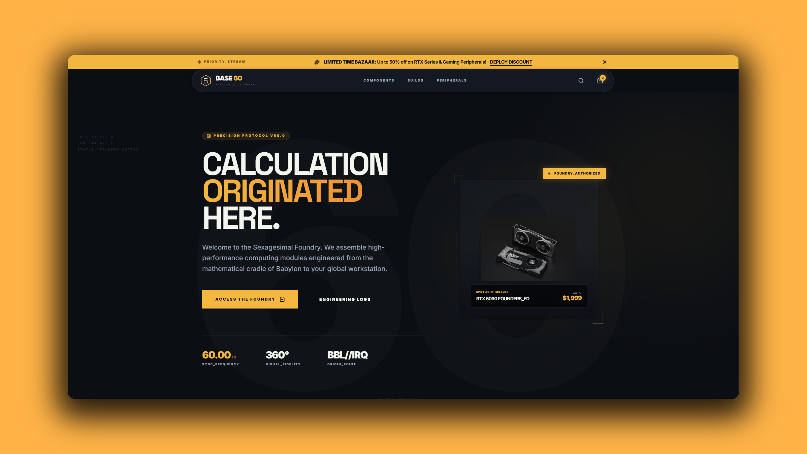
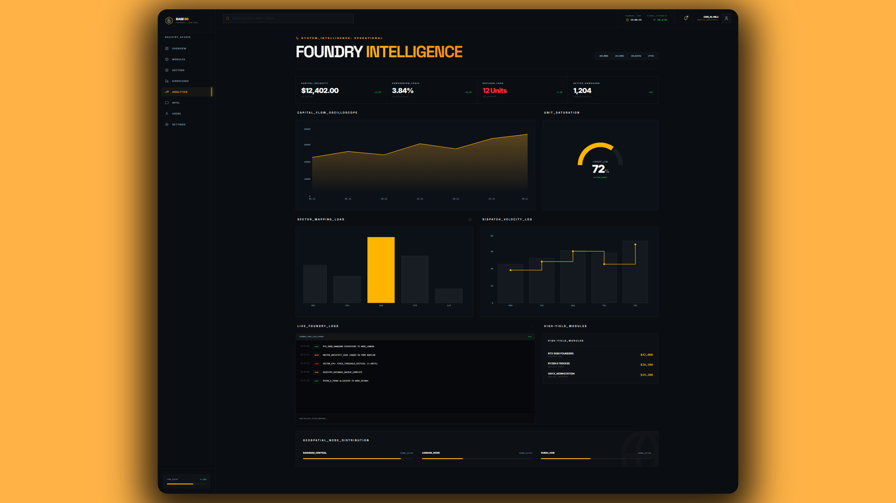
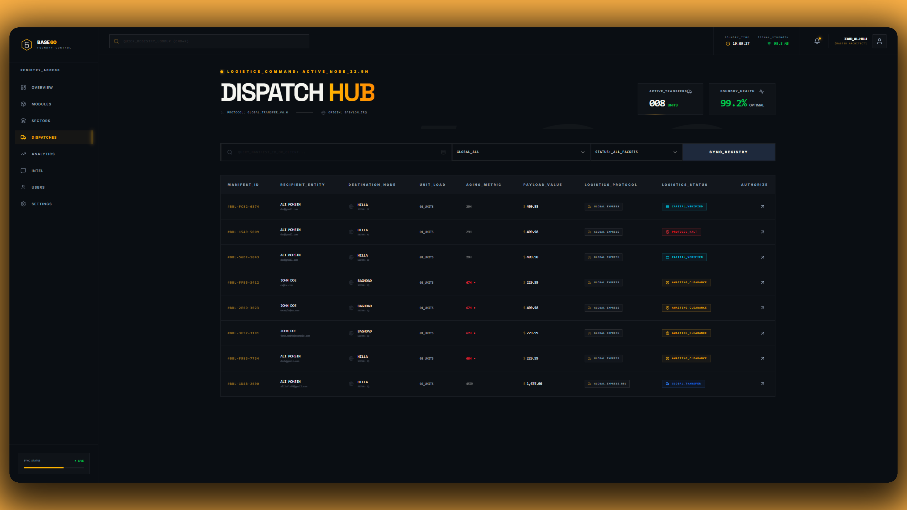
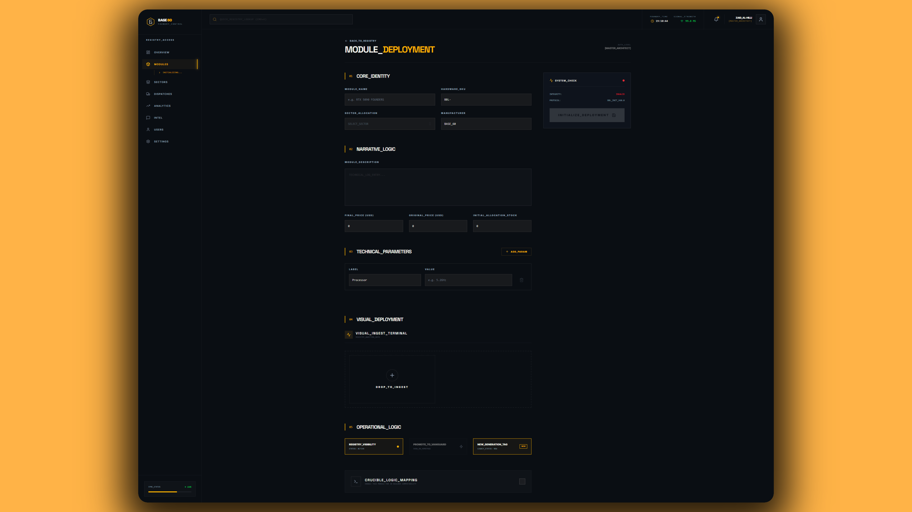

# BASE 60 // Global Hardware Foundry



**BASE 60** is a high-fidelity e-commerce platform and 3D configuration terminal for elite computer hardware.

Unlike standard e-commerce templates, this project implements a **"Foundry Architecture"**—prioritizing data density, industrial aesthetics, and rigorous validation logic over standard web conventions. It features a fully interactive **3D PC Builder (The Crucible)**, a command-center style **Admin Dashboard**, and an atomic **Logistics Protocol**.

---

## ⚡ System Modules (Features)

### 🛠️ The Crucible (3D PC Architect)

A logic-aware 3D configurator built with **React Three Fiber**.

- **Holographic Assembly:** Hardware modules snap into place using relative coordinate mapping (Parent-Child hierarchy).
- **Logic Engine:** Real-time compatibility checks (Socket mismatch, Wattage calculation, Dimension clearance).
- **Dual-View Protocol:** Users can toggle between **Holographic** (3D) and **Schematic** (High-density list) modes for low-end device optimization.
- **Exploded View:** "Iron Man" style animation using **GSAP** vectors to inspect internal components.

### 👁️ The Overseer (Admin Terminal)

A high-density dashboard for managing the foundry.

- **Telemetry Hub:** Real-time charts (Recharts) visualizing Capital Flow, Sector Saturation, and Dispatch Velocity.
- **Registry Manager:** Advanced data tables with server-side filtering, sorting, and "Deep Scan" preview drawers.
- **Visual Ingest Port:** Drag-and-drop asset management with optimistic previews and **UploadThing** cloud synchronization.

### 📦 Logistics & Commerce

- **Atomic Transactions:** Uses **Prisma Interactive Transactions** to ensure Order Creation, Stock Decrement, and Payment Confirmation happen in a single, fail-safe operation.
- **Secure Handshake:** Two-stage checkout flow (Logistics Validation $\rightarrow$ Stripe Payment Intent).
- **Optimistic Manifest:** Zustand-powered cart that updates the UI instantly while syncing with the database in the background.

---

## 🏗️ Technical Stack

**Core Architecture**

- **Framework:** Next.js 15 (App Router)
- **Language:** TypeScript (Strict Mode)
- **Styling:** Tailwind CSS + Shadcn UI (Heavily Customized for "Foundry" Aesthetic)
- **Animations:** Framer Motion (UI) & GSAP (3D Physics)

**The 3D Engine**

- **Render:** React Three Fiber (R3F)
- **Helpers:** @react-three/drei
- **Optimization:** Draco Compression & Adaptive DPR

**Data & Backend**

- **Database:** PostgreSQL (via Supabase/Neon)
- **ORM:** Prisma
- **Validation:** Zod (Schema-first design)
- **API Layer:** Next-Safe-Action (Type-safe Server Actions)
- **Storage:** UploadThing
- **Payments:** Stripe

---

## 📐 Architecture Highlights

### 1. The "Logic Resolver" Pattern

Instead of hardcoding compatibility rules in the UI, I built a pure logic engine (`resolveCompatibility`) that accepts a `Manifest` state and returns a `DiagnosticReport`.

```typescript
// Example: Checking if GPU fits in Case
if (GPU.length > CHASSIS.maxGpuLength) {
	alerts.push({
		code: "PHYSICAL_OVERFLOW",
		severity: "CRITICAL",
	});
}
```

### 2. Server-Container / Client-Island

The application strictly follows the Next.js Server Components paradigm.

- **Pages** are Server Components (Data Fetching, SEO).
- **Interactive Widgets** (Search, Forms, 3D Scene) are isolated Client Components ("Islands").
- This ensures maximum **LCP (Largest Contentful Paint)** performance while maintaining interactivity.

### 3. The "Foundry" Design System

I broke away from standard Bootstrap/Material design principles:

- **Zero Border Radius:** Strict industrial corners.
- **1px Grid Layouts:** Using `gap-px` to create physical seams between modules.
- **Monospace Data:** All numerical data uses `Geist Mono` for tabular readability.

---

## 🚀 Initialization (Getting Started)

### 1. Clone the Repository

```bash
git clone https://github.com/your-username/base-60.git
cd base-60
```

### 2. Install Dependencies

```bash
npm install
```

### 3. Environment Config

Create a `.env` file in the root:

```env
DATABASE_URL="postgresql://..."
NEXT_PUBLIC_STRIPE_PUBLISHABLE_KEY="pk_test_..."
STRIPE_SECRET_KEY="sk_test_..."
STRIPE_WEBHOOK_SECRET="whsec_..."
UPLOADTHING_SECRET="..."
UPLOADTHING_APP_ID="..."
```

### 4. Database Sync

```bash
npx prisma generate
npx prisma db push
```

### 5. Launch the Foundry

```bash
npm run dev
```

---

## 📸 Visual Intelligence

|              The Crucible (3D Builder)              |            The Overseer (Dashboard)             |
| :-------------------------------------------------: | :---------------------------------------------: |
|  |  |

|                   Dispatch Hub                    |                   Visual Ingest                   |
| :-----------------------------------------------: | :-----------------------------------------------: |
|  |  |

---

## 🛡️ License

This project is an architectural showcase. All rights reserved.
**Authorization Level:** `VANGUARD_ARCHITECT`
